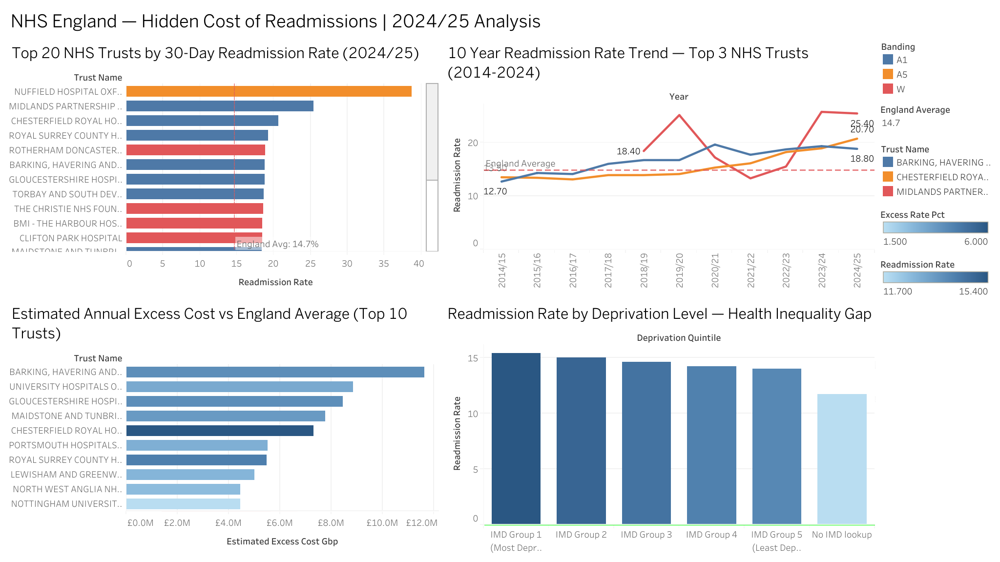

# 🏥 NHS Weekend Admissions — 30-Day Readmission Risk Analysis

## 📊 Live Dashboard

👉 [View on Tableau Public](https://public.tableau.com/app/profile/gunasundar.ram.chandrasekhar.sholingaram/viz/NHS-Weekend-Admissions-Readmission-Analysis/Dashboard1)

---

## 🎯 Business Question
Which NHS Trusts, diagnosis groups, and deprivation levels drive 
disproportionate 30-day readmission rates and what is the projected 
annual cost of closing the top 3 gaps?

---

## 💡 Key Findings

- 🔴 **Midlands Partnership NHS Foundation Trust** has the highest 
readmission rate in England at **25.4%** — nearly double the national 
average of 14.7%
- 📈 **Barking, Havering & Redbridge** has deteriorated consistently 
over 10 years from 12.7% (2014) to 18.8% (2024)
- 💷 Closing the gap at the **top 3 trusts alone would save an estimated 
£29 million annually** (based on NHS reference cost of £2,800 per 
emergency readmission)
- ⚖️ The most deprived communities experience **1.4 percentage points 
higher** readmission rates than the least deprived — a systemic 
health inequality signal

---

## 🛠️ Tools & Methods

| Layer | Tool | Purpose |
|-------|------|---------|
| Data extraction | PostgreSQL + pgAdmin | 5 analytical SQL queries |
| Analysis | Google Sheets | Cost model & summary |
| Visualisation | Tableau Public | 4-visual interactive dashboard |
| Data source | NHS Digital Compendium I02040/I02041 | 155,573 provider records |

---

## 🔍 SQL Queries

| Query | Purpose |
|-------|---------|
| Q1 | Top 20 trusts by readmission rate (2024/25) |
| Q2 | 10-year trend for top 3 trusts |
| Q3 | Diagnosis groups — Stroke & hip fracture |
| Q4 | Cost projection — excess readmissions × £2,800 |
| Q5 | Deprivation gradient analysis |

---

## ⚠️ Assumptions & Limitations
- Cost estimate uses NHS National Schedule 2023/24 reference cost 
of £2,800 per emergency readmission
- Analysis covers all ages, all persons, snapshot method
- Small trusts with fewer than 100 discharges excluded from cost model
- Data source: NHS Digital, published May 2025
